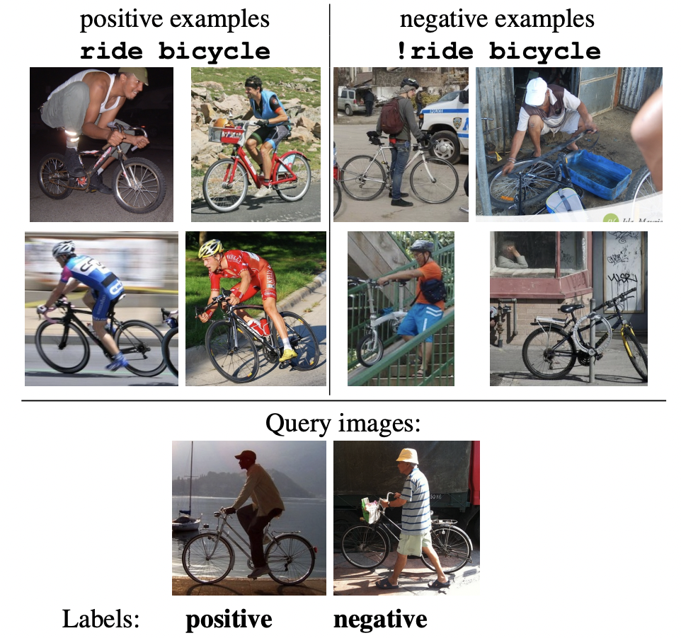
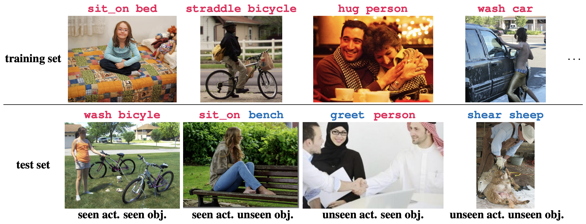

Bongard-HOI
===
<p align="center"></p>

This repository hosts the code for the paper:

[Bongard-HOI: Benchmarking Few-Shot Visual Reasoning for Human-Object Interactions (CVPR 2022, oral)](https://web.cs.ucla.edu/~xm/file/bongardhoi_cvpr22.pdf)

by [Huaizu Jiang*](https://jianghz.me/), [Xiaojian Ma*](http://web.cs.ucla.edu/~xm), [Weili Nie](https://weilinie.github.io/), [Zhiding Yu](https://chrisding.github.io/), [Yuke Zhu](https://www.cs.utexas.edu/~yukez/) and [Anima Anandkumar](http://tensorlab.cms.caltech.edu/users/anima/)

## Abstract

A significant gap remains between today's visual pattern recognition models and human-level visual cognition especially when it comes to few-shot learning and compositional reasoning of novel concepts. We introduce **Bongard-HOI**, a new visual reasoning benchmark that focuses on compositional learning of human-object interactions (HOIs) from natural images. It is inspired by two desirable characteristics from the classical Bongard problems (BPs): 1) few-shot concept learning, and 2) context-dependent reasoning. We carefully curate the few-shot instances with hard negatives, where positive and negative images only disagree on action labels, making mere recognition of object categories insufficient to complete our benchmarks. We also design multiple test sets to systematically study the generalization of visual learning models, where we vary the overlap of the HOI concepts between the training and test sets of few-shot instances, from partial to no overlaps. Bongard-HOI presents a substantial challenge to today's visual recognition models. The state-of-the-art HOI detection model achieves only **62%** accuracy on few-shot binary prediction while even amateur human testers on MTurk have **91%** accuracy. With the Bongard-HOI benchmark, we hope to further advance research efforts in visual reasoning, especially in holistic perception-reasoning systems and better representation learning.

## Installation

- Install PyTorch:
    ```shell
    conda install pytorch torchvision torchaudio cudatoolkit=11.3 -c pytorch
    ```

- Install the necessary packages with `requirements.txt`:
    ```shell
    pip install -r requirements.txt
    ```

The code has been tested with Python 3.8, PyTorch 1.11.0 and CUDA 11.3 on Ubuntu 20.04

##  Data Preparation

Please refer to [data preparation](assets/dataset.md)

## Training

```shell
bash scripts/train_bongard_image.sh configs/<config_file>
```

### Note

- `<config_file>` and the models we evaluated in the paper can be found below
    | `<config_file>`                         | Model in the paper |
    |-----------------------------------------|--------------------|
    | `train_cnn_imagebd.yaml`                | `CNN-Baseline`     |
    | `train_wren_imagebd.yaml`               | `WReN-BP`          |
    | `train_protoNet_rn_bbox_imagebd.yaml`   | `ProroNet`         |
    | `train_metaOptNet_rn_bbox_imagebd.yaml` | `MetaOptNet`       |
    | `train_snail_rn_bbox_imagebd.yaml`      | `ANIL`             |
    | `train_meta_rn_bbox_imagebd.yaml`       | `Meta-Baseline`    |

- In `<config_file>`, you may use `use_gt_bbox` to control whether the groud truth bounding boxes will be used

- In `<config_file>`, you may use `encoder_pretrain` to control which pretrained model will be used. Currently, we support three options: `scratch`, `imagenet` and `mocov2`

- Training logs, checkpoints, etc will be saved to `./save_dist`

- All the GPUs will be used by default. To run with the recommended batch size, you may need up to 8 V100 32G GPUs. Some models (ex. `CNN-Baseline` and `Meta-Baseline`) require less GPUs.

## Testing

```shell
bash scripts/train_bongard_image.sh configs/<config_file> --test_only --test_model <path to best_model.pth>
```

### Note

- Bongard-HOI has four test sets (illustrated as below). It is recommended to report both the accuracies on these four test sets and their average.

<p align="center"></p>


- Please make sure `<config_file>` is the same as training.

## License

Please check the LICENSE file. This work may be used non-commercially, meaning for research or evaluation purposes only. For business inquiries, please contact researchinquiries@nvidia.com.

Please note that this repo only hosts the code of Bongard-HOI, the Bongard-HOI datasest is released by Caltech and shall not be viewed as part of the source code.

## Acknowledgement

The code of Bongard-HOI requires images from [HAKE](http://hake-mvig.cn/) and Bongard-HOI annotations. However, both images and annotations are not owned or hosted by NVIDIA. Please contact [Xiaojian Ma](mailto:xiaojian.ma@ucla.edu) if you have any issue with them.

## Citation

Please consider citing our paper if you find our work helpful for your research:

```
@inproceedings{jiang2022bongard,
  title={Bongard-HOI: Benchmarking Few-Shot Visual Reasoning for Human-Object Interactions},
  author={Jiang, Huaizu and Ma, Xiaojian and Nie, Weili and Yu, Zhiding and Zhu, Yuke and Anandkumar, Anima},
  booktitle={Proceedings of the IEEE/CVF Conference on Computer Vision and Pattern Recognition (CVPR)},
  year={2022}
}
```